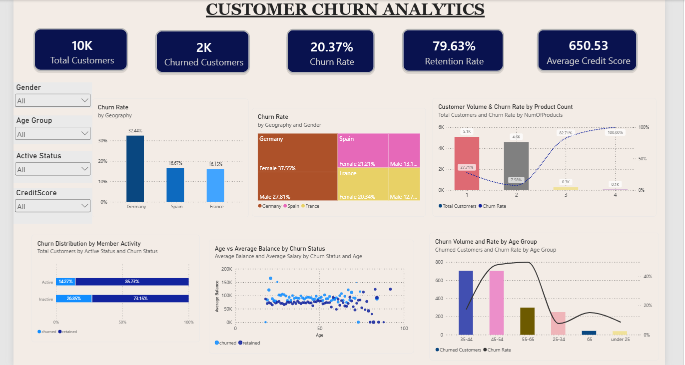
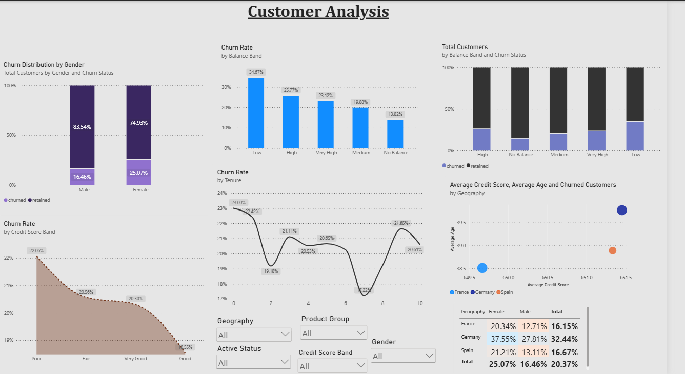
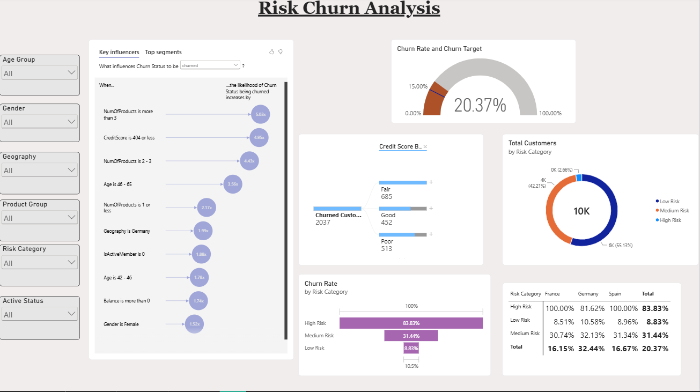

# 🏦 Bank Churn Analytics — Power BI Dashboard

An interactive **Bank Customer Churn Analytics dashboard** built using **Microsoft Power BI** to analyze customer attrition, retention, demographics, financial characteristics, account behavior, and churn risk.

The project transforms customer-level banking data into an interactive business intelligence solution that helps identify customer segments associated with higher churn and provides a deeper understanding of potential churn drivers.

---

## 📊 Project Overview

Customer churn is a major challenge for banking institutions. Losing existing customers can affect revenue, customer lifetime value, and long-term business growth.

This project analyzes bank customer data to understand:

* Overall customer churn and retention
* Customer demographics associated with churn
* Customer activity and engagement
* Account and financial characteristics
* Product usage
* Credit score patterns
* Balance and tenure patterns
* Customer risk categories
* Factors that can help explain customer churn

The analysis is presented through a **three-page interactive Power BI dashboard** with KPI cards, charts, slicers, Key Influencers, and a Decomposition Tree.

---

## 🎯 Project Objectives

The main objectives of this project are:

1. Analyze the overall customer churn rate.
2. Measure the number of churned and retained customers.
3. Understand customer characteristics associated with churn.
4. Analyze churn across different age groups.
5. Examine the relationship between product count and churn.
6. Compare churn across geographical regions.
7. Analyze churn based on customer activity status.
8. Study the relationship between credit score and churn.
9. Analyze churn across different balance bands.
10. Examine churn patterns across customer tenure.
11. Analyze churn by gender and geography.
12. Segment customers according to their churn risk.
13. Identify potential churn drivers using Power BI's **Key Influencers** visual.
14. Explore churn using a **Decomposition Tree**.

---

## 🏦 Business Problem

Banks need to retain existing customers while identifying customers who may be at greater risk of leaving.

A simple churn percentage does not explain **why** customers are leaving. Therefore, the objective of this dashboard is to move from basic reporting toward exploratory analysis by examining churn across multiple customer characteristics.

The dashboard helps answer questions such as:

* How many customers have churned?
* What is the overall churn rate?
* Which age groups show higher churn?
* Does customer activity relate to churn?
* Does the number of products held by a customer relate to churn?
* How does churn vary across geography?
* How does churn vary across credit score groups?
* Are certain balance ranges associated with different churn rates?
* How does customer tenure relate to churn?
* Which customer risk categories contain more customers?
* What factors appear to influence churn?

---

# 🛠️ Tools & Technologies

| Tool / Technology               | Purpose                                     |
| ------------------------------- | ------------------------------------------- |
| **Microsoft Power BI**          | Dashboard development and visualization     |
| **Power Query**                 | Data preparation and transformation         |
| **DAX**                         | Measures and analytical calculations        |
| **Power BI Key Influencers**    | Identifying potential churn drivers         |
| **Power BI Decomposition Tree** | Exploring churn through multiple dimensions |
| **Data Visualization**          | Communicating customer churn patterns       |

---

# 🔄 Data Preparation & Transformation

The customer data was prepared for analysis within Power BI.

The project uses derived analytical fields to make customer segmentation and churn analysis easier.

Important derived fields used in the dashboard include:

* **Age Group**
* **Active Status**
* **Balance Band**
* **Credit Score Band**
* **Product Group**
* **Risk Category**
* **Churn Status**

These fields allow customers to be grouped into meaningful categories and compared across churn-related metrics.

---

# 📐 Key Measures

The dashboard uses DAX measures to calculate important business metrics.

Key measures included in the Power BI model are:

* **Total Customers**
* **Churned Customers**
* **Churn Rate**
* **Retention Rate**
* **Average Credit Score**
* **Average Balance**
* **Average Salary**
* **Average Age**

These measures are used throughout the dashboard to provide dynamic results when users interact with slicers and visualizations.

### Example — Churn Rate

```DAX
Churn Rate =
DIVIDE(
    [Churned Customers],
    [Total Customers],
    0
)
```

The measure calculates the proportion of customers who have churned relative to the total customer population.

---

# 📊 Dashboard Structure

The dashboard contains **three analytical pages**.

---

## 1️⃣ Page 1 — Churn Overview

The first page provides a high-level overview of the bank's customer base and churn performance.

### KPI Cards

The page includes KPI cards for:

* **Total Customers**
* **Churned Customers**
* **Churn Rate**
* **Retention Rate**
* **Average Credit Score**

These KPIs provide an immediate overview of customer retention performance.

### Visualizations

#### Churn Volume and Rate by Age Group

A combination chart compares:

* Churned customer volume
* Churn rate
* Age groups

This helps identify age segments with different levels of customer attrition.

#### Customer Volume & Churn Rate by Product Count

This visualization compares customer volume and churn rate across the number of products held by customers.

It helps examine whether product ownership is associated with customer retention.

#### Churn Rate by Geography

Churn rate is compared across the available geographical regions.

#### Churn Distribution by Member Activity

This visualization compares churn distribution across:

* Active customers
* Inactive customers

It provides insight into the relationship between customer engagement and churn.

#### Age vs Average Balance by Churn Status

A scatter chart compares:

* Customer age
* Average balance
* Churn status

This allows customer characteristics to be viewed from multiple dimensions simultaneously.

#### Geography × Gender Churn Analysis

A treemap provides a visual breakdown of churn rate across geography and gender.

### Slicers

Page 1 includes interactive filters for:

* Gender
* Age Group
* Active Status
* Credit Score

---

# 2️⃣ Page 2 — Customer & Financial Analysis

The second page focuses on deeper analysis of customer demographics, financial characteristics, credit scores, balances, and tenure.

### Visualizations

#### Churn Rate by Balance Band

Compares churn rates across different customer balance categories.

#### Churn Distribution by Gender

Shows the distribution of churned and retained customers across gender categories.

#### Churned Customers vs Average Credit Score and Age

A scatter visualization allows customer churn to be examined in relation to:

* Average credit score
* Average age
* Geography
* Churned customer volume

#### Churn Rate by Credit Score Band

Analyzes churn rates across different credit score categories.

#### Churn Rate by Tenure

A line chart shows how churn rate varies according to customer tenure.

#### Churn Distribution by Balance Band

Compares churned and retained customers across balance categories.

#### Geography × Gender Churn Analysis

A matrix-style analysis provides churn rate comparisons across:

* Geography
* Gender

### Slicers

Page 2 provides filters for:

* Active Status
* Gender
* Credit Score Band
* Geography
* Product Group

These filters allow users to investigate specific customer segments.

---

# 3️⃣ Page 3 — Churn Risk & Drivers

The third page focuses on **customer risk analysis and deeper churn investigation**.

This page goes beyond descriptive charts by using Power BI's built-in analytical visuals.

### Risk Category Distribution

A donut chart displays customer distribution across different **Risk Categories**.

This provides a high-level view of the composition of the customer base according to risk classification.

### Churn Rate by Risk Category

A funnel visualization compares churn rate across different risk categories.

This allows higher- and lower-risk customer segments to be examined.

### Geography × Risk Category

A matrix compares churn rate across:

* Geography
* Risk Category

This helps identify combinations of location and risk category where churn rates differ.

### Churn Rate vs Churn Target

A gauge visual compares the current churn rate against the defined churn target.

This provides a quick indication of performance relative to the target.

### Key Influencers

The **Key Influencers** visual is used to investigate factors associated with the selected churn outcome.

Potential explanatory attributes analyzed include characteristics such as:

* Gender
* Geography
* Age
* Balance
* Credit Score
* Active Member status
* Number of Products

This provides a more analytical approach to understanding customer churn.

### Decomposition Tree

The Decomposition Tree is used to break down **Churned Customers** through multiple dimensions.

The analysis can be explored using attributes such as:

* Geography
* Gender
* Age Group
* Active Status
* Product Group
* Credit Score Band
* Tenure

This allows users to interactively drill into different customer segments and explore where churn is concentrated.

### Slicers

Page 3 includes filters for:

* Geography
* Gender
* Age Group
* Active Status
* Product Group
* Risk Category

---

# 📈 Analytical Areas Covered

The dashboard analyzes customer churn across several dimensions.

### 👤 Customer Demographics

* Gender
* Age
* Age Group
* Geography

### 💳 Financial Characteristics

* Balance
* Balance Band
* Estimated Salary
* Credit Score
* Credit Score Band

### 🏦 Account Characteristics

* Number of Products
* Product Group
* Tenure
* Active Status

### ⚠️ Churn & Risk

* Churn Status
* Churn Rate
* Retention Rate
* Churned Customers
* Risk Category
* Churn Target

---

# 🔍 Key Analytical Questions

The dashboard enables users to investigate questions such as:

### Customer Retention

* What proportion of customers have churned?
* What proportion of customers have been retained?
* How does churn vary across customer segments?

### Demographics

* Which age groups have different churn rates?
* How does churn differ between genders?
* How does geography affect churn?

### Customer Engagement

* Are inactive customers associated with higher churn?
* How does active membership relate to customer retention?

### Products

* Does the number of products held by a customer relate to churn?
* How does churn vary across product groups?

### Financial Characteristics

* How does churn vary across balance bands?
* Is there a visible relationship between credit score and churn?
* How does customer salary relate to other customer characteristics?

### Tenure

* Does customer churn vary according to tenure?
* Are certain tenure groups associated with different churn patterns?

### Risk

* How are customers distributed across risk categories?
* Which risk categories show higher churn?
* Does risk vary across geographical regions?

### Churn Drivers

* Which customer characteristics appear to influence churn?
* Which combinations of characteristics contain larger numbers of churned customers?

---

# 💡 Business Applications

The insights from this dashboard can support banking organizations in developing customer retention strategies.

### 1. Targeted Retention

Customers belonging to segments with relatively high churn rates can be prioritized for retention campaigns.

### 2. Customer Engagement

Inactive customers can be identified for targeted engagement initiatives designed to increase their interaction with banking services.

### 3. Personalized Product Strategies

Product ownership patterns can be analyzed to identify opportunities for better product recommendations and cross-selling.

### 4. Risk-Based Customer Management

Risk categories can help organizations prioritize customers for proactive retention efforts.

### 5. Data-Driven Decision Making

Instead of relying only on overall churn figures, decision-makers can examine churn across multiple customer dimensions and identify specific segments requiring attention.

---

# 📷 Dashboard Preview

## Page 1 — Churn Overview



## Page 2 — Customer & Financial Analysis



## Page 3 — Churn Risk & Drivers



---

# 📁 Repository Structure

```text
Bank-Churn-Analytics-PowerBI/
│
├── README.md
│
├── PowerBI/
│   └── bank_churn_bi.pbix
│
├── Screenshots/
│   ├── page1_overview.png
│   ├── page2_customer_analysis.png
│   └── page3_churn_risk_analysis.png
│
└── Documentation/
    └── Bank_Churn_Analytics_Report.pdf
```

---

# 🚀 How to Use the Dashboard

1. Download the `bank_churn_bi.pbix` file from the **PowerBI** folder.
2. Open the file using **Microsoft Power BI Desktop**.
3. If Power BI requests the source data, update the relevant data source path.
4. Refresh the dataset if required.
5. Navigate through the three dashboard pages.
6. Use the available slicers to filter the analysis.
7. Interact with charts to cross-filter other visualizations.
8. Use the Key Influencers and Decomposition Tree visuals on Page 3 for deeper analysis.

---

# 📌 Project Highlights

* ✅ Interactive 3-page Power BI dashboard
* ✅ Customer churn and retention analysis
* ✅ Dynamic KPI cards
* ✅ Demographic analysis
* ✅ Financial analysis
* ✅ Product and account analysis
* ✅ Credit score analysis
* ✅ Balance and tenure analysis
* ✅ Risk categorization
* ✅ Interactive slicers
* ✅ Key Influencers analysis
* ✅ Decomposition Tree analysis
* ✅ DAX-based business measures
* ✅ Interactive cross-filtering

---

# 🎓 Skills Demonstrated

This project demonstrates practical skills in:

* **Business Intelligence**
* **Power BI**
* **Data Visualization**
* **Power Query**
* **DAX**
* **Data Transformation**
* **Exploratory Data Analysis**
* **Customer Segmentation**
* **Churn Analysis**
* **Business Analytics**
* **Interactive Dashboard Design**
* **Analytical Storytelling**

---

# 📜 Project Information

**Project:** Bank Churn Analytics

**Domain:** Banking & Financial Services

**Category:** Data Analytics / Business Intelligence

**Primary Tool:** Microsoft Power BI

**Analysis Focus:** Customer Churn & Retention

**Dashboard Pages:** 3

---

## 👩‍💻 Author

**Sakshi Mishra**

B.Voc — Data Analytics

---

⭐ If you found this project useful, consider giving the repository a star!
